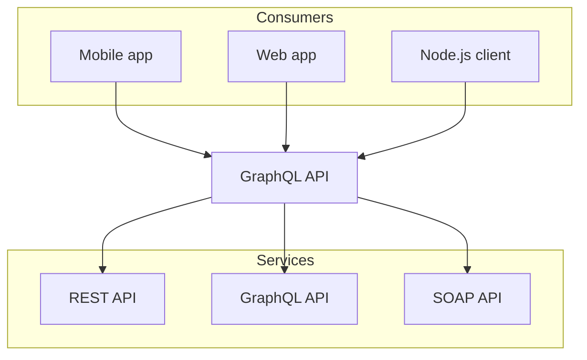

import { Tabs, Steps } from "nextra/components";

# Welcome to Nextra

Hello, world!

```ts filename="my example" copy {1,4-5}
import { useState } from "react";

function Counter() {
  const [count, setCount] = useState(0);
  return <button onClick={() => setCount(count + 1)}>{count}</button>;
}
```

```ansi
 ✓ src/index.test.ts (1)
   Test Files  1 passed (1)
        Tests  1 passed (1)
     Start at  23:32:41
     Duration  11ms
   PASS  Waiting for file changes...
         press h to show help, press q to quit
```

```sh npm2yarn
npm i -D @graphql-eslint/eslint-plugin
```



<Steps>
### Step 1
 
Contents for step 1.
 
### Step 2
 
Contents for step 2.
</Steps>

 
<Tabs items={['pnpm', 'npm', 'yarn']} defaultIndex="1">
  <Tabs.Tab>**pnpm**: Fast, disk space efficient package manager.</Tabs.Tab>
  <Tabs.Tab>**npm** is a package manager for the JavaScript programming language.</Tabs.Tab>
  <Tabs.Tab>**Yarn** is a software packaging system.</Tabs.Tab>
</Tabs>