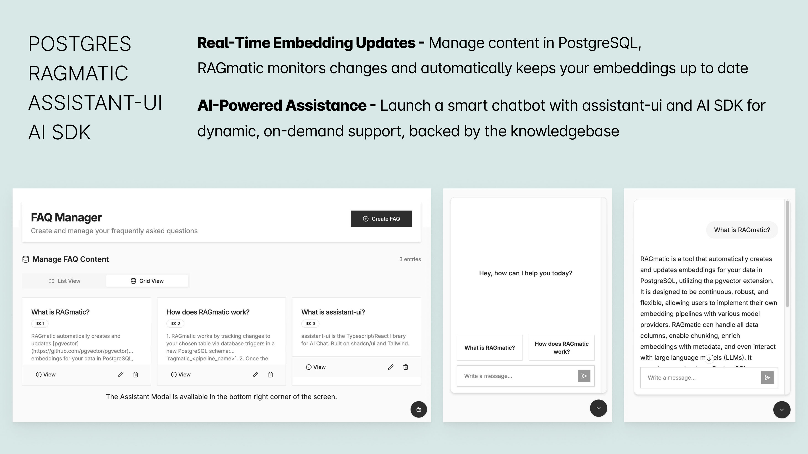

# Customer Support Assistant UI Example

This is an example application demonstrating how to build a customer support chatbot with continuous embedding generation by [RAGmatic](https://github.com/petekp/ragmatic)



## Features

- 🤖 AI-powered chatbot using [Assistant UI](https://github.com/assistant-ui/assistant-ui) components and [AI SDK](https://sdk.vercel.ai/)
- 🔄 **Continuous embedding generation** - RAGmatic watches for FAQ changes and automatically updates embeddings
- 📝 A CMS to manage FAQs (create, edit, delete) backed by PostgreSQL and Drizzle ORM

## Try it out

The best way to experience this example:

1. Create several FAQs through the dashboard
2. Edit an existing FAQ to see RAGmatic automatically update embeddings
3. Ask the assistant questions related to your FAQs
4. Notice how the assistant retrieves and cites the relevant FAQ content

## Getting Started

### Setup

1. Clone this example:

```bash
pnpx degit BarnacleLabs/RAGmatic/examples/customer-support-assistant-ui customer-support-assistant-ui
```

2. Copy `.env.example` to `.env` and fill in your environment variables

### Installation

```bash
# Install dependencies
pnpm install

# Start the database
pnpm db:up

# Run database migrations
pnpm db:migrate

# Start the RAGmatic embeddings service (in a separate terminal)
pnpm start-embeddings

# Start the development server
pnpm dev
```

## Usage

1. Navigate to `http://localhost:3000` to access the FAQ dashboard
2. Create FAQs through the dashboard interface
3. Access the chatbot through the floating button in the bottom right corner
4. Ask questions related to your FAQs to test the assistant

## Project Structure

```
/
├── app/                  # Next.js app directory
│   ├── api/              # API routes
│   │   └── chat/         # Chat API endpoint
│   └── page.tsx          # Main page component
├── components/           # React components
│   ├── assistant-ui/     # Assistant UI components
│   ├── faq-dashboard.tsx # FAQ management dashboard
│   ├── faq-form.tsx      # FAQ creation form
│   ├── faq-list.tsx      # FAQ listing component
│   └── ui/               # UI components (shadcn/ui)
├── embeddings/           # Embedding generation & search
│   ├── ragmatic.ts       # RAGmatic pipeline to run on the database
│   ├── ragmatic.schema.ts # RAGmatic schema to access generated embeddings with drizzle
│   └── search.ts         # Vector search implementation
├── lib/                  # Utility functions and libraries
│   ├── actions/          # Server actions
│   ├── db/               # Database setup and migrations
│   └── utils.ts          # Helper utilities
└── public/               # Static assets
```

## Key Technologies

- [Next.js](https://nextjs.org/) - React framework
- [RAGmatic](https://github.com/petekp/ragmatic) - Continuous embedding generation and management
- [AI SDK](https://sdk.vercel.ai/) - AI SDK for chat completions
- [Assistant UI](https://github.com/assistant-ui/assistant-ui) - Chat interface components
- [shadcn/ui](https://ui.shadcn.com/) - UI components
- [OpenAI](https://platform.openai.com/docs/guides/embeddings) - Embeddings and chat completions
- [Drizzle ORM](https://orm.drizzle.team/docs/overview) - Database ORM
- [pgvector](https://github.com/pgvector/pgvector) - Vector search
- [PostgreSQL](https://www.postgresql.org/) - Database

## License

MIT
